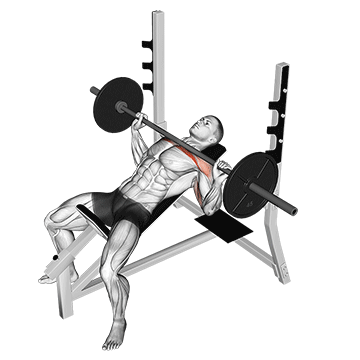

# Supino Inclinado

O supino inclinado é excelente para trabalhar a parte superior do peitoral, além de ativar tríceps e deltoides.

---

## Execução

1. Ajuste o banco em um ângulo de 30 a 45 graus.
2. Deite-se e posicione os pés no chão.
3. Segure a barra com as mãos um pouco mais afastadas que os ombros.
4. Abaixe a barra até a parte superior do peito.
5. Empurre a barra para cima até estender os cotovelos.

---

## Dicas

- Não exagere na inclinação do banco.
- Mantenha o abdômen contraído.
- Controle o movimento e a respiração.

---

## Imagem

---

## Vídeo

> Adicione um vídeo do exercício aqui, por exemplo:
>
> [Vídeo demonstrativo no YouTube](https://www.youtube.com/watch?v=DbFgADa2PL8)

---

## Músculos trabalhados

- Peitoral maior (porção superior)
- Tríceps braquial
- Deltoide anterior
